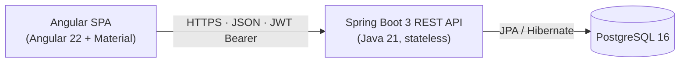
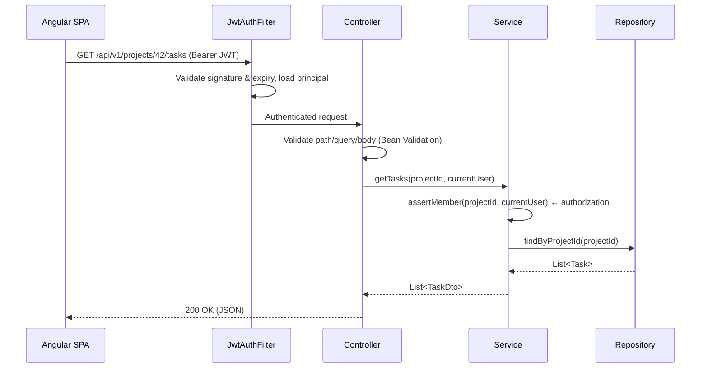

# ARCHITECTURE — TaskFlow

Top-level architecture, system design, data flow, and folder structure. This document is the source of truth for *where code goes* and *how layers talk to each other*.

---

## 1. System Overview



- **Two deployables:** the SPA (static files) and the API (fat jar / container). They are developed in one repository but are independently buildable.
- **Stateless API:** no server-side session. Every request carries a JWT; any instance can serve any request.
- **Single database:** PostgreSQL, owned exclusively by the API. Nothing else touches the DB.

## 2. Repository Layout

```
taskflow/
├── context/                  # These docs (PRD, DESIGN, ARCHITECTURE, SCHEMA, RULES)
├── backend/                  # Spring Boot application (Maven)
├── frontend/                 # Angular application
├── docker-compose.yml        # Local dev: postgres + backend + frontend
└── README.md
```

## 3. Backend Architecture

### 3.1 Layering (strict, one-directional)

```
Controller  →  Service  →  Repository  →  PostgreSQL
   (web)       (domain)      (data)
```

| Layer | Responsibility | Must NOT |
|---|---|---|
| **Controller** | HTTP concerns: routing, status codes, request/response DTOs, validation triggers | Contain business logic; touch repositories directly |
| **Service** | Business rules, authorization checks, transactions (`@Transactional`) | Return entities to controllers; know about HTTP |
| **Repository** | Data access (Spring Data JPA interfaces) | Contain business logic |
| **Entity** | JPA persistence model | Leak past the service layer |
| **DTO / Mapper** | API contract; entity↔DTO conversion (manual mappers, no MapStruct for MVP) | Hold logic beyond mapping |

Dependency rule: a layer only calls the layer directly below it. Controllers never see entities; services never build `ResponseEntity`.

### 3.2 Package structure (package-by-feature)

```
backend/src/main/java/com/taskflow/
├── TaskflowApplication.java
├── common/
│   ├── exception/            # ApiException hierarchy, GlobalExceptionHandler
│   ├── security/             # JWT filter, SecurityConfig, CurrentUser resolver
│   └── config/               # CORS, Jackson, OpenAPI config
├── auth/                     # AuthController, AuthService, dto/
├── user/                     # UserController, UserService, User, UserRepository, dto/
├── project/                  # ProjectController, ProjectService, Project, ProjectMember, dto/
├── task/                     # TaskController, TaskCommentController, services, Task, TaskComment, dto/
└── dashboard/                # DashboardController, DashboardService, dto/ (read-only aggregation over project + task)
```

The `dashboard/` feature is read-only: it aggregates across the `project` and `task` features (through their services, never their repositories) to assemble the caller's dashboard. It owns no entity of its own.

Each feature package is self-contained: controller, service, entities, repository, DTOs. Cross-feature access goes through the other feature's **service**, never its repository.

### 3.3 Request flow



### 3.4 Error handling (one pattern, everywhere)

- Domain exceptions extend `ApiException(HttpStatus, code, message)` — e.g. `ResourceNotFoundException`, `ForbiddenException`, `DuplicateEmailException`.
- A single `@RestControllerAdvice` (`GlobalExceptionHandler`) maps exceptions + Bean Validation failures to one JSON shape:

```json
{ "code": "TASK_NOT_FOUND", "message": "Task 42 was not found", "fieldErrors": [] }
```

- Services throw; controllers never try/catch. No stack traces or SQL in responses.

### 3.5 API conventions

- Base path `/api/v1`, plural nouns: `/projects/{id}/tasks`
- Verbs via HTTP methods only; no `/getTasks` style endpoints
- `POST` → 201 + created resource; `DELETE` → 204; validation failure → 400; missing → 404; not permitted → 403
- Pagination: `?page=0&size=20&sort=dueDate,asc` (Spring Pageable), responses wrap in `PageResponse<T>`
- OpenAPI spec auto-generated (springdoc) at `/api/docs` — dev profile only

## 4. Frontend Architecture

### 4.1 Structure (standalone components, feature folders)

```
frontend/src/app/
├── app.config.ts             # Providers: router, http, interceptors
├── app.routes.ts             # Lazy-loaded feature routes
├── core/                     # Singletons, loaded once
│   ├── auth/                 # AuthStore (signals), auth.interceptor, auth.guard
│   ├── api/                  # ApiClient wrappers per resource
│   └── layout/               # Shell: toolbar, nav rail
├── features/
│   ├── auth/                 # login / register pages
│   ├── dashboard/
│   ├── projects/             # list, detail, member management
│   └── tasks/                # board, list view, task dialog
└── shared/                   # Dumb reusable UI: priority-badge, status-chip,
                              # empty-state, confirm-dialog, pipes
```

Rules: `features` may import from `core` and `shared`; `shared` imports from neither; `core` never imports from `features`. No NgModules — standalone components only.

### 4.2 State management

- **Signals, no NgRx.** Scale of the app does not justify a store library.
- Server state lives in lightweight signal stores per feature (`TaskStore`), holding `data / loading / error` signals and exposing computed views (e.g. tasks grouped by status).
- Optimistic updates for status changes and drag-drop; rollback + snackbar on API failure.
- Auth state (`currentUser`, token) in `AuthStore`; token persisted in `localStorage`, refresh handled by the interceptor on 401.

### 4.3 Data flow

```
Component (signal read, template)
   ↓ user action
Store method → ApiClient (typed) → HttpClient + auth.interceptor
   ↓ response
Store updates signals → computed() recalculates → template re-renders
```

Components never call `HttpClient` directly, never hold copies of server state, and stay presentation-only. Smart/container components live at route level; everything below is dumb (inputs/outputs).

## 5. Cross-Cutting Concerns

| Concern | Decision |
|---|---|
| AuthN | JWT (HS256) access 60 min + refresh 7 days; refresh rotation, revocation table |
| AuthZ | Service-layer checks (`assertMember`, `assertOwner`) — see SCHEMA.md §Access Control |
| Validation | Client-side for UX, Bean Validation server-side as the authority |
| Transactions | `@Transactional` at service methods; read-only where applicable |
| Migrations | Flyway, versioned `V{n}__description.sql`, run on startup |
| Config | `application.yml` + environment overrides; secrets only via env vars |
| Logging | SLF4J structured logging; request-id (MDC) filter; no logging of tokens/passwords |
| Testing | JUnit 5 + Mockito (service), MockMvc + Testcontainers (API/repo), Karma/Jasmine (frontend units) |
| Local dev | `docker compose up -d postgres` + native backend/frontend; `docker compose --profile full up` runs the whole stack in containers |

## 6. Design Principles Applied

- **KISS first:** no CQRS, no event bus, no microservices, no Redis — a modular monolith and one DB serve the MVP. Revisit only with evidence.
- **Package-by-feature over package-by-layer:** deleting `task/` removes the feature without touching the rest.
- **Explicit over clever:** manual DTO mappers, plain services, no reflection magic beyond Spring's baseline.
- **One way to do each thing:** one error shape, one pagination pattern, one state pattern. Consistency beats micro-optimization.
