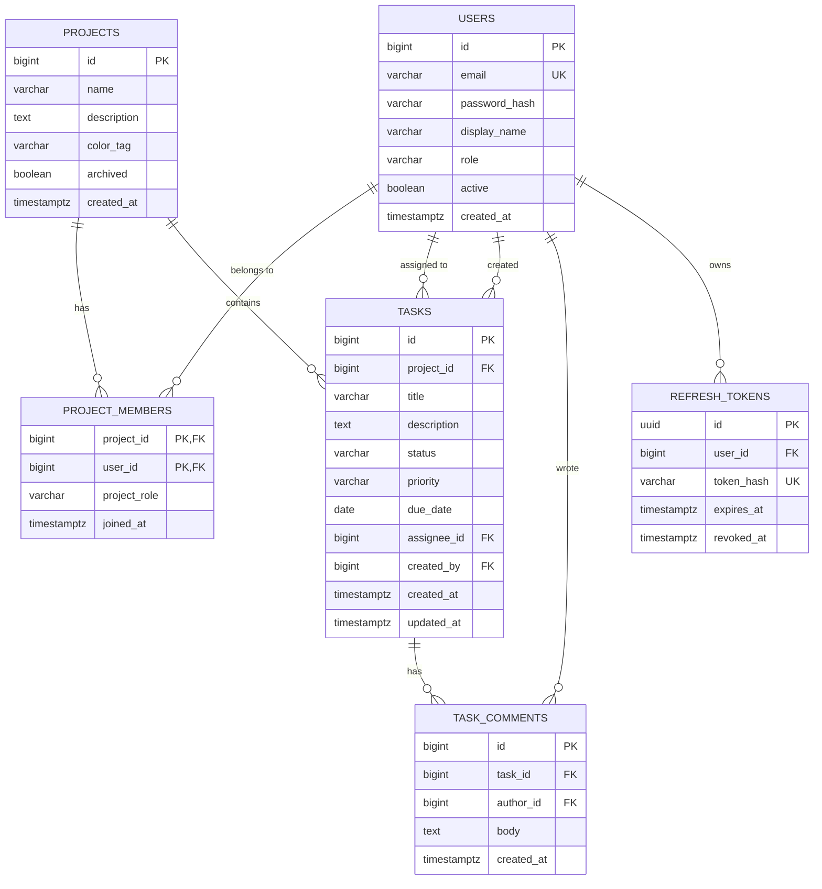

# SCHEMA — TaskFlow

Database schema, ERD, migrations, access control, and JPA model conventions. PostgreSQL 16, managed exclusively by Flyway.

---

## 1. ERD



## 2. Tables

### 2.1 `users`

| Column | Type | Constraints |
|---|---|---|
| `id` | `bigint generated always as identity` | PK |
| `email` | `varchar(255)` | NOT NULL, UNIQUE (case-insensitive: unique index on `lower(email)`) |
| `password_hash` | `varchar(100)` | NOT NULL (BCrypt) |
| `display_name` | `varchar(100)` | NOT NULL |
| `role` | `varchar(20)` | NOT NULL, CHECK `role IN ('USER','ADMIN')`, default `'USER'` |
| `active` | `boolean` | NOT NULL, default `true` |
| `created_at` | `timestamptz` | NOT NULL, default `now()` |

### 2.2 `projects`

| Column | Type | Constraints |
|---|---|---|
| `id` | `bigint generated always as identity` | PK |
| `name` | `varchar(120)` | NOT NULL |
| `description` | `text` | NULL |
| `color_tag` | `varchar(20)` | NOT NULL (one of the 8 preset palette keys) |
| `archived` | `boolean` | NOT NULL, default `false` |
| `created_at` | `timestamptz` | NOT NULL, default `now()` |

### 2.3 `project_members`

| Column | Type | Constraints |
|---|---|---|
| `project_id` | `bigint` | PK (composite), FK → `projects.id` ON DELETE CASCADE |
| `user_id` | `bigint` | PK (composite), FK → `users.id` ON DELETE CASCADE |
| `project_role` | `varchar(20)` | NOT NULL, CHECK `project_role IN ('OWNER','MEMBER')` |
| `joined_at` | `timestamptz` | NOT NULL, default `now()` |

Invariant (service-enforced): every project has ≥ 1 OWNER at all times.

### 2.4 `tasks`

| Column | Type | Constraints |
|---|---|---|
| `id` | `bigint generated always as identity` | PK |
| `project_id` | `bigint` | NOT NULL, FK → `projects.id` ON DELETE CASCADE |
| `title` | `varchar(200)` | NOT NULL |
| `description` | `text` | NULL |
| `status` | `varchar(20)` | NOT NULL, CHECK `status IN ('TODO','IN_PROGRESS','DONE')`, default `'TODO'` |
| `priority` | `varchar(20)` | NOT NULL, CHECK `priority IN ('LOW','MEDIUM','HIGH')`, default `'MEDIUM'` |
| `due_date` | `date` | NULL |
| `assignee_id` | `bigint` | NULL, FK → `users.id` ON DELETE SET NULL |
| `created_by` | `bigint` | NOT NULL, FK → `users.id` |
| `created_at` | `timestamptz` | NOT NULL, default `now()` |
| `updated_at` | `timestamptz` | NOT NULL, default `now()` (maintained by JPA `@PreUpdate`) |

### 2.5 `task_comments`

| Column | Type | Constraints |
|---|---|---|
| `id` | `bigint generated always as identity` | PK |
| `task_id` | `bigint` | NOT NULL, FK → `tasks.id` ON DELETE CASCADE |
| `author_id` | `bigint` | NOT NULL, FK → `users.id` |
| `body` | `text` | NOT NULL, CHECK `length(body) <= 2000` |
| `created_at` | `timestamptz` | NOT NULL, default `now()` |

### 2.6 `refresh_tokens`

| Column | Type | Constraints |
|---|---|---|
| `id` | `uuid` | PK, default `gen_random_uuid()` |
| `user_id` | `bigint` | NOT NULL, FK → `users.id` ON DELETE CASCADE |
| `token_hash` | `varchar(64)` | NOT NULL, UNIQUE (SHA-256 of the token — raw token never stored) |
| `expires_at` | `timestamptz` | NOT NULL |
| `revoked_at` | `timestamptz` | NULL |

## 3. Indexes

Beyond PKs/uniques:

```sql
CREATE INDEX idx_tasks_project_status ON tasks (project_id, status);
CREATE INDEX idx_tasks_assignee ON tasks (assignee_id) WHERE assignee_id IS NOT NULL;
CREATE INDEX idx_tasks_due_date ON tasks (due_date) WHERE due_date IS NOT NULL;
CREATE INDEX idx_comments_task ON task_comments (task_id);
CREATE INDEX idx_members_user ON project_members (user_id);
CREATE INDEX idx_refresh_user ON refresh_tokens (user_id);
```

## 4. Access Control — service layer, NOT RLS

**Decision:** authorization is enforced in the Spring service layer, not with Postgres Row-Level Security.

**Why:** the API connects with a single application DB role; the database has no per-user identity to key RLS on without passing session variables per request. With one app owning the DB (see ARCHITECTURE.md), service-layer checks are the standard Spring approach — simpler, testable with plain unit tests, and visible in the same code that implements the rules. Do **not** add RLS policies unless a second DB consumer appears.

**The rules every service must enforce:**

| Action | Requirement |
|---|---|
| Read project / its tasks / comments | Project member (or ADMIN) |
| Create/edit/delete tasks, comment | Project member |
| Edit/archive project, manage members | Project OWNER (or ADMIN) |
| Remove last OWNER | Forbidden |
| User management endpoints | ADMIN |
| Any write by `active = false` user | Forbidden (rejected at JWT filter) |

Implementation: `ProjectAuthService.assertMember(projectId, userId)` / `assertOwner(projectId, userId)` called as the **first line** of every service method that touches project-scoped data. Missing membership → `ForbiddenException` (403); nonexistent resource → `ResourceNotFoundException` (404).

## 5. Migrations (Flyway)

- Location: `backend/src/main/resources/db/migration`
- Naming: `V{n}__snake_case_description.sql` — e.g. `V1__create_users.sql`
- **Migrations are immutable once merged.** Fixes are new migrations, never edits.
- No `flyway.clean` outside local dev. No JPA `ddl-auto` beyond `validate`.

Planned sequence:

| Version | Content |
|---|---|
| `V1__create_users.sql` | `users` + unique lower(email) index |
| `V2__create_projects.sql` | `projects`, `project_members` |
| `V3__create_tasks.sql` | `tasks`, `task_comments` + indexes |
| `V4__create_refresh_tokens.sql` | `refresh_tokens` |

## 6. JPA Model Conventions

- Entities mirror tables 1:1; enums (`Role`, `TaskStatus`, `TaskPriority`, `ProjectRole`) stored as `@Enumerated(EnumType.STRING)` matching the CHECK constraints.
- IDs: `@GeneratedValue(strategy = GenerationType.IDENTITY)`.
- Timestamps: `Instant` in Java ↔ `timestamptz`; `due_date` is `LocalDate` (no timezone semantics).
- Associations: `@ManyToOne(fetch = FetchType.LAZY)` always — no `EAGER`, no `@OneToMany` collections on entities unless a real use case needs them (prefer repository queries).
- No entity is ever serialized to JSON — DTOs only (see ARCHITECTURE.md §3.1).
- Repository queries that list tasks join-fetch assignee to avoid N+1.
